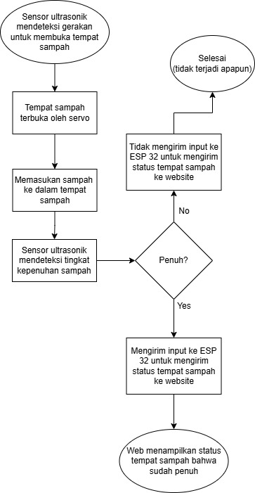
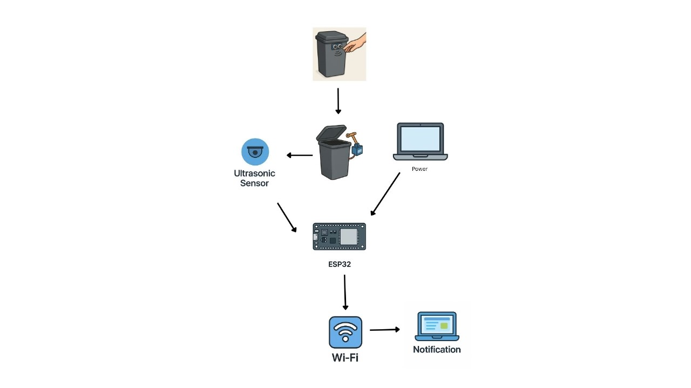
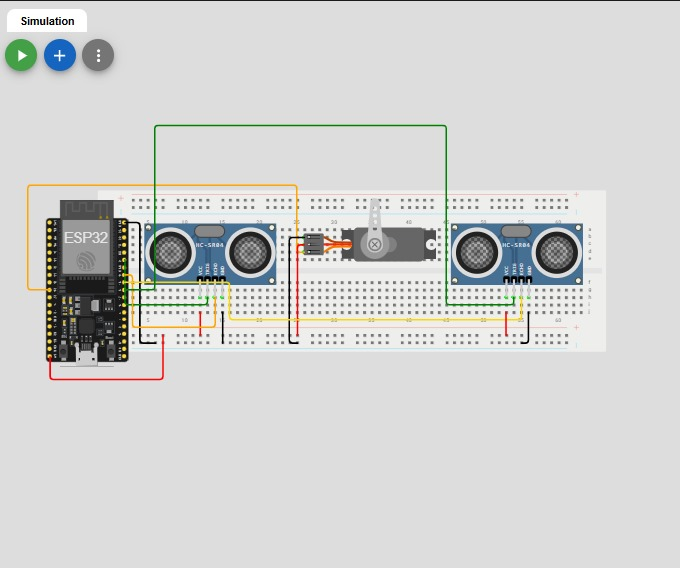
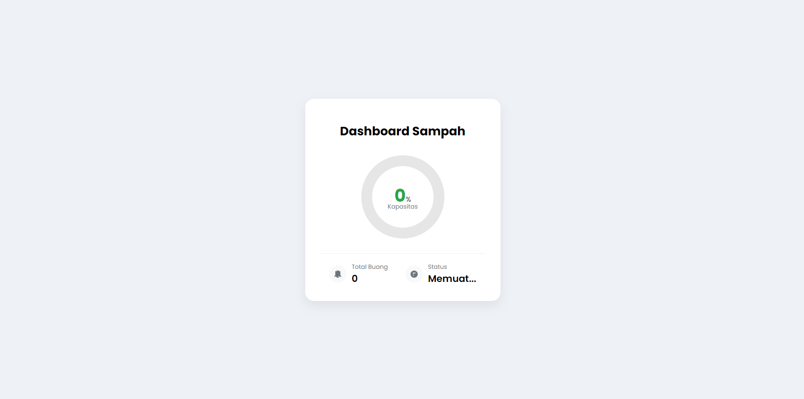

# 🗑️ SmartBin: Pemantau Sampah Berbasis IoT

## 📋 Deskripsi Singkat

**SmartBin** adalah sistem tempat sampah pintar berbasis IoT yang dirancang untuk meningkatkan efisiensi pengelolaan sampah dan kebersihan lingkungan. Tempat sampah ini mampu mendeteksi tingkat kepenuhan sampah di dalamnya menggunakan sensor ultrasonic. 

### ✨ Fitur Utama:
- **Deteksi Kepenuhan Otomatis**: Sensor ultrasonik mendeteksi tingkat kepenuhan sampah
- **Kontrol Tutup Pintar**: Tutup tidak akan terbuka jika tempat sampah sudah penuh
- **Notifikasi Real-time**: Peringatan otomatis ke website saat sampah penuh
- **Pencatatan Aktivitas**: Menghitung jumlah orang yang membuang sampah per hari melalui deteksi buka-tutup
- **Dashboard Web**: Pemantauan status tempat sampah secara real-time

## 🎯 Tujuan Proyek

### A. Inovasi Teknologi
Mendorong penerapan teknologi inovatif dalam pengelolaan sampah, seperti penggunaan ESP32 dan sistem IoT dalam bidang kebersihan lingkungan.

### B. Efisiensi Pengelolaan Sampah
Memberikan informasi tentang tingkat kepenuhan sampah, memungkinkan pengelolaan dan pengosongan yang lebih efisien oleh petugas kebersihan. Petugas tidak perlu mengecek tempat sampah secara berkala, cukup melihat status di website.

### C. Pemantauan Real-time
Membuat dashboard informatif berbasis website untuk memantau status tempat sampah secara real-time.

### D. Peningkatan Kebersihan dan Higienitas
Mengurangi sentuhan langsung antara petugas kebersihan dengan tempat sampah ketika mengecek status kepenuhan.

## 🌍 SDGs yang Disasar

| SDG | Deskripsi | Kontribusi |
|-----|-----------|------------|
| **SDG 9** | Industry, Innovation and Infrastructure | Mendorong inovasi teknologi dalam pengelolaan sampah dan infrastruktur kota yang lebih modern dan efisien |
| **SDG 3** | Good Health and Well-Being | Mengurangi risiko penyebaran penyakit melalui sentuhan pada tempat sampah, berkontribusi pada peningkatan kesehatan dan higienitas publik |
| **SDG 11** | Sustainable Cities and Communities | Mendukung upaya menciptakan kota yang lebih bersih, sehat, dan layak huni dengan solusi pengelolaan sampah yang inovatif |

## 🔧 Komponen Hardware

| Komponen | Jumlah | Fungsi |
|----------|--------|--------|
| ESP32 | 1 | Mikrokontroler utama untuk pemrosesan dan konektivitas WiFi |
| Sensor Ultrasonik HC-SR04 | 2 | Mendeteksi tingkat kepenuhan dan aktivitas buka-tutup |
| Servo Motor | 1 | Mengontrol mekanisme buka-tutup tempat sampah |
| Breadboard & Kabel Jumper | - | Untuk penyambungan rangkaian elektronik |

## 🎨 Diagram Sistem

### Flowchart Sistem

### Diagram Rangkaian

### Simulasi Wokwi

### Web Interface

## 📊 Cara Kerja Sistem

1. **Deteksi Gerakan**: Sensor ultrasonik mendeteksi gerakan untuk membuka tempat sampah
2. **Pengecekan Kapasitas**: Sistem mengecek tingkat kepenuhan sebelum membuka tutup
3. **Kontrol Akses**: Jika penuh, tutup tidak akan terbuka dan selesai tidak terjadi apapun
4. **Pencatatan Data**: Memasukkan sampah ke dalam tempat sampah dan mencatat aktivitas
5. **Monitoring Kepenuhan**: Sensor ultrasonik terus mendeteksi tingkat kepenuhan
6. **Notifikasi**: Jika penuh, sistem mengirim input ke ESP32 untuk menampilkan peringatan di website
7. **Status Display**: Website menampilkan status bahwa tempat sampah sudah penuh

## 🚀 Instalasi dan Setup

### Prasyarat
- Arduino IDE atau PlatformIO
- ESP32 Development Board
- Library yang diperlukan:
  - WiFi
  - WebServer
  - NewPing (untuk sensor ultrasonik)
  - Servo

### Langkah Instalasi
1. Clone repository ini
2. Install library yang diperlukan
3. Konfigurasi WiFi credentials
4. Upload code ke ESP32
5. Akses web interface melalui IP ESP32

## 💻 Teknologi yang Digunakan

- **Hardware**: ESP32, Sensor Ultrasonik HC-SR04, Servo Motor
- **Programming**: C++ (Arduino Framework)
- **Connectivity**: WiFi
- **Web Interface**: HTML, CSS, JavaScript
- **Protocol**: HTTP

## 📈 Manfaat dan Dampak

### Manfaat Lingkungan
- Pengelolaan sampah yang lebih efisien
- Pengurangan limbah yang tidak terkelola
- Peningkatan kebersihan lingkungan

### Manfaat Sosial
- Peningkatan higienitas publik
- Efisiensi kerja petugas kebersihan
- Penerapan teknologi smart city

### Manfaat Ekonomi
- Pengurangan biaya operasional pengelolaan sampah
- Optimalisasi jadwal pengumpulan sampah
- Peningkatan produktivitas petugas

## 🔮 Pengembangan Masa Depan

- Integrasi dengan sistem notifikasi mobile
- Penambahan sensor untuk klasifikasi jenis sampah
- Implementasi machine learning untuk prediksi pola penggunaan
- Integrasi dengan sistem manajemen kota pintar

## 👥 Tim Pengembang

Proyek ini dikembangkan sebagai bagian dari mata kuliah Internet of Things (IoT).
FerdinandTJ
Haekal1243

## 📄 Lisensi

Proyek ini dilisensikan di bawah [MIT License](LICENSE).

---

**🌱 Bersama-sama menciptakan lingkungan yang lebih bersih dan pintar untuk masa depan yang berkelanjutan!**
