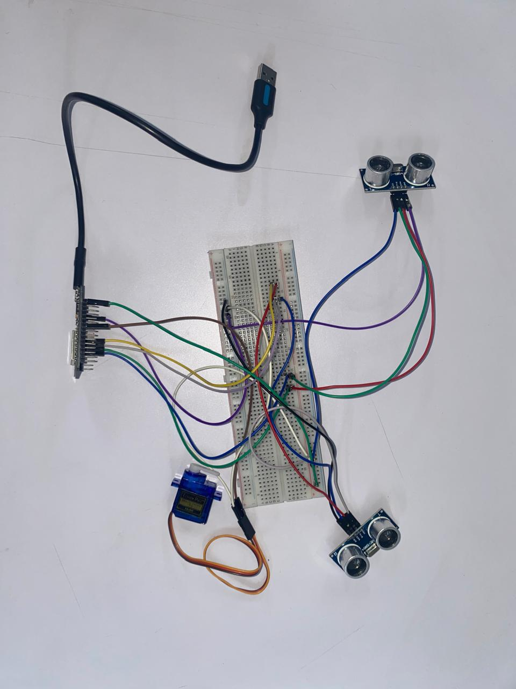

# 🗑️ SmartBin: Pemantau Sampah Berbasis IoT

## 📝 Daftar Task Proyek

| Task | Status | Deskripsi |
|------|--------|-----------|
| **Task 1** | ✅ **Selesai** | Topik dan Penjelasan |
| **Task 2** | ✅ **Selesai** | Diagram Blok Sistem |
| **Task 3** | ✅ **Selesai** | Desain Sistem Lengkap UI/UX Software dan Hardware |
| **Task 4** | ✅ **Selesai** | Implementasi Hardware |
| **Task 5** | ✅ **Selesai** | Implementasi Software |
| **Task 6** | ✅ **Selesai** | Integrasi Software + Hardware |
| **Task 7** | ✅ **Selesai** | Pengujian Sistem dan Penyempurnaan |
| **Task 8** | 🔄 **On Progress** | Laporan Akhir |

---

## 📋 Deskripsi Singkat
> **📌 Task 1: Topik dan Penjelasan**

**SmartBin** adalah sistem tempat sampah pintar berbasis IoT yang dirancang untuk meningkatkan efisiensi pengelolaan sampah dan kebersihan lingkungan. Tempat sampah ini mampu mendeteksi tingkat kepenuhan sampah di dalamnya menggunakan sensor ultrasonic. 

### ✨ Fitur Utama:
- **Deteksi Kepenuhan Otomatis**: Sensor ultrasonik mendeteksi tingkat kepenuhan sampah
- **Kontrol Tutup Pintar**: Tutup tidak akan terbuka jika tempat sampah sudah penuh
- **Notifikasi Real-time**: Peringatan otomatis ke website saat sampah penuh
- **Pencatatan Aktivitas**: Menghitung jumlah orang yang membuang sampah per hari melalui deteksi buka-tutup
- **Dashboard Web**: Pemantauan status tempat sampah secara real-time

## 🎯 Tujuan Proyek

### A. Inovasi Teknologi
Mendorong penerapan teknologi inovatif dalam pengelolaan sampah, seperti penggunaan ESP32 dan sistem IoT dalam bidang kebersihan lingkungan.

### B. Efisiensi Pengelolaan Sampah
Memberikan informasi tentang tingkat kepenuhan sampah, memungkinkan pengelolaan dan pengosongan yang lebih efisien oleh petugas kebersihan. Petugas tidak perlu mengecek tempat sampah secara berkala, cukup melihat status di website.

### C. Pemantauan Real-time
Membuat dashboard informatif berbasis website untuk memantau status tempat sampah secara real-time.

### D. Peningkatan Kebersihan dan Higienitas
Mengurangi sentuhan langsung antara petugas kebersihan dengan tempat sampah ketika mengecek status kepenuhan.

## 🌍 SDGs yang Disasar

| SDG | Deskripsi | Kontribusi |
|-----|-----------|------------|
| **SDG 9** | Industry, Innovation and Infrastructure | Mendorong inovasi teknologi dalam pengelolaan sampah dan infrastruktur kota yang lebih modern dan efisien |
| **SDG 3** | Good Health and Well-Being | Mengurangi risiko penyebaran penyakit melalui sentuhan pada tempat sampah, berkontribusi pada peningkatan kesehatan dan higienitas publik |
| **SDG 11** | Sustainable Cities and Communities | Mendukung upaya menciptakan kota yang lebih bersih, sehat, dan layak huni dengan solusi pengelolaan sampah yang inovatif |

## 🔧 Spesifikasi Teknis

### Hardware Requirements
- ESP32 Development Board
- Sensor Ultrasonik HC-SR04 (2 unit)
- Servo Motor SG90
- Breadboard dan Kabel Jumper
- Power Supply 5V

### Software Requirements  
- Arduino IDE atau PlatformIO
- Library WiFi, WebServer, NewPing, Servo
- Web Browser untuk akses interface

---

## 🎨 Diagram Sistem
> **📌 Task 2: Diagram Blok Sistem**

### Flowchart Sistem

### Diagram Rangkaian

---

## 🎯 Desain Sistem Lengkap
> **📌 Task 3: Desain Sistem Lengkap UI/UX Software dan Hardware**

### Simulasi Wokwi

### Web Interface Design

---

## ⚡ Implementasi Hardware
> **📌 Task 4: Implementasi Hardware**

### Rangkaian Hardware
Berikut adalah implementasi rangkaian hardware yang telah dibuat:

### Komponen Hardware yang Digunakan

| Komponen | Jumlah | Fungsi |
|----------|--------|--------|
| ESP32 | 1 | Mikrokontroler utama untuk pemrosesan dan konektivitas WiFi |
| Sensor Ultrasonik HC-SR04 | 2 | Mendeteksi tingkat kepenuhan dan aktivitas buka-tutup |
| Servo Motor | 1 | Mengontrol mekanisme buka-tutup tempat sampah |
| Breadboard & Kabel Jumper | - | Untuk penyambungan rangkaian elektronik |

---

## 💻 Implementasi Software
> **📌 Task 5: Implementasi Software**

### 📁 Repository Kode Lengkap
**Link ke source code:** [GitHub Repository](https://github.com/FerdinandTJ/IoTProject_SmartTrashBin/blob/main/Code/main.py)

### 📚 Dependencies dan Library
- **Servo Library**: untuk kontrol motor servo

---

## 🔗 Integrasi Software + Hardware
> **📌 Task 6: Integrasi Software + Hardware**

### 📁 Repository Integrasi Lengkap
**Link ke integration code:** [GitHub Integration Branch](https://github.com/FerdinandTJ/IoTProject_SmartTrashBin/blob/main/Code/main.py)

### 📚 Library untuk Integrasi
- **Servo Library**: Kontrol motor servo

---

## 🧪 Pengujian Sistem dan Penyempurnaan
> **📌 Task 7: Pengujian Sistem dan Penyempurnaan**

### Video Demo Sistem
🎥 **Demo Video**: 

**[▶️ Video Demo di Google Drive](https://drive.google.com/file/d/1SSqHGHf2D3U5HYs9fffNHdCTxxVARh_p/view?usp=sharing)**

### Hasil Pengujian
- ✅ **Test 1**: Deteksi kepenuhan sampah - **PASSED**
- ✅ **Test 2**: Kontrol buka-tutup otomatis - **PASSED**  
- ✅ **Test 3**: Notifikasi real-time ke website - **PASSED**
- ✅ **Test 4**: Responsifitas web interface - **PASSED**

### Penyempurnaan yang harus dilakukan
1. **Kalibrasi Sensor**: Menyesuaikan threshold sensor ultrasonik
2. **Error Handling**: Menambahkan penanganan error koneksi
3. **Power Management**: Optimisasi konsumsi daya sistem

---

## 📄 Laporan Akhir
> **📌 Task 8: Laporan Akhir (On Progress)**

🔄 **Status**: Sedang dalam proses penyusunan laporan akhir lengkap

---

## 📊 Cara Kerja Sistem

1. **Deteksi Gerakan**: Sensor ultrasonik mendeteksi gerakan untuk membuka tempat sampah
2. **Pengecekan Kapasitas**: Sistem mengecek tingkat kepenuhan sebelum membuka tutup
3. **Kontrol Akses**: Jika penuh, tutup tidak akan terbuka dan selesai tidak terjadi apapun
4. **Pencatatan Data**: Memasukkan sampah ke dalam tempat sampah dan mencatat aktivitas
5. **Monitoring Kepenuhan**: Sensor ultrasonik terus mendeteksi tingkat kepenuhan
6. **Notifikasi**: Jika penuh, sistem mengirim input ke ESP32 untuk menampilkan peringatan di website
7. **Status Display**: Website menampilkan status bahwa tempat sampah sudah penuh

## 🚀 Instalasi dan Setup

### Prasyarat
- Thonny Ide
- ESP32 Development Board
- Library yang diperlukan (sudah tercantum di Task 5)

### Langkah Instalasi
1. Clone repository ini: `git clone [repository-url]`
2. Install library yang diperlukan melalui Github Repository Servo Lib
3. Konfigurasi WiFi credentials di file config
4. Upload code ke ESP32 menggunakan Thonny
5. Akses web interface melalui IP address ESP32
6. Sistem siap digunakan

---

## 💻 Teknologi yang Digunakan

- **Hardware**: ESP32, Sensor Ultrasonik HC-SR04, Servo Motor
- **Programming**: MicroPython
- **Connectivity**: WiFi
- **Web Interface**: HTML, CSS, JavaScript
- **Protocol**: HTTP

## 📈 Manfaat dan Dampak

### Manfaat Lingkungan
- Pengelolaan sampah yang lebih efisien
- Pengurangan limbah yang tidak terkelola
- Peningkatan kebersihan lingkungan

### Manfaat Sosial
- Peningkatan higienitas publik
- Efisiensi kerja petugas kebersihan
- Penerapan teknologi smart city

### Manfaat Ekonomi
- Pengurangan biaya operasional pengelolaan sampah
- Optimalisasi jadwal pengumpulan sampah
- Peningkatan produktivitas petugas

## 🔮 Pengembangan Masa Depan

- Integrasi dengan sistem notifikasi mobile
- Penambahan sensor untuk klasifikasi jenis sampah
- Implementasi machine learning untuk prediksi pola penggunaan
- Integrasi dengan sistem manajemen kota pintar

## 👥 Tim Pengembang

Proyek ini dikembangkan sebagai bagian dari mata kuliah Internet of Things (IoT).
FerdinandTJ
Haekal1243

## 📄 Lisensi

Proyek ini dilisensikan di bawah [MIT License](LICENSE).

---
